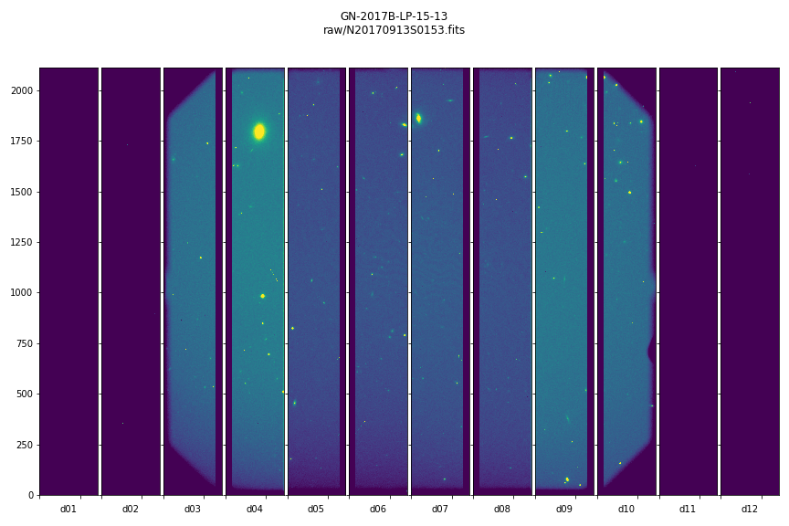
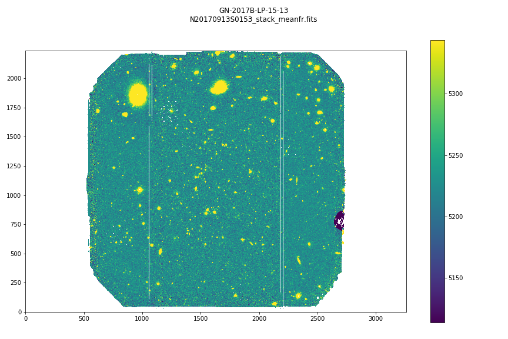

==============================================
DRAGONS vs IRAF - GMOS Data Reduction Tutorial
==============================================

.. .. admonition:: Document ID

..    PIPE-USER-116_GMOSImg-DRTutorial

This is a brief tutorial on how to reduce GMOS images using DRAGONS, and how it
compares with the IRAF way. It is based on information found in the `GEMINI
GMOS WebPage <https://www.gemini.edu/sciops/instruments/gmos/>`_ and in the
DRAGONS_.  It is also based on the `GMOS Data Reduction Tutorial
<TODO:/put/link/here>`_, which covers the basics of reducing GMOS_ data using
DRAGONS_. We refer to this tutorial for the installation of DRAGONS_.

.. contents::

.. _DRAGONS: https://dragons.readthedocs.io/

.. _`Gemini Observatory Archive (GOA)`: https://archive.gemini.edu/

.. _GMOS: https://www.gemini.edu/sciops/instruments/gmos/

Downloading the tutorial datasets
=================================

The data for this tutorial comes from the GN-2017B-LP-15 program (PI: Adam
Stanford). It can be downloaded from the `Gemini Observatory Archive (GOA)`_:

- Science: `Search Link <https://archive.gemini.edu/searchform/GN-2017B-LP-15-13/RAW/cols=CTOWEQ/2x2/notengineering/GMOS-N/NotFail>`__, `Files (6 files, 0.04 Gb) <https://archive.gemini.edu/download/GN-2017B-LP-15-13/notengineering/2x2/RAW/GMOS-N/NotFail/present/canonical>`__

- Bias: `Search Link <https://archive.gemini.edu/searchform/NotFail/RAW/cols=CTOWEQ/2x2/notengineering/GMOS-N/low/20170914/fullframe/slow/BIAS>`__, `Files (5 files, 0.02 Gb) <https://archive.gemini.edu/download/present/readspeed=slow/2x2/RAW/GMOS-N/gain=low/20170914/fullframe/NotFail/BIAS/notengineering/canonical>`__

- Flats: `Search Link <https://archive.gemini.edu/searchform/NotFail/RAW/object=Twilight/cols=CTOWEQ/2x2/filter=z/notengineering/GMOS-N/low/20170915/fullframe/slow>`__, `Files (14 files, 0.11 Gb) <https://archive.gemini.edu/download/present/object=Twilight/readspeed=slow/2x2/filter=z/RAW/GMOS-N/gain=low/20170915/fullframe/NotFail/notengineering/canonical>`__

About the dataset
=================

After the data is downloaded and extracted in a directory we can have a look
at what we have. Let us call the command tool "|typewalk|"::

    $ typewalk

    directory:  /data/Tutorials/gmos/GN-2017B-LP-15-13/raw
        N20170913S0153.fits ............... (GEMINI) (GMOS) (IMAGE) (NORTH) (RAW) (SIDEREAL) (UNPREPARED)
        N20170913S0154.fits ............... (GEMINI) (GMOS) (IMAGE) (NORTH) (RAW) (SIDEREAL) (UNPREPARED)
        N20170913S0155.fits ............... (GEMINI) (GMOS) (IMAGE) (NORTH) (RAW) (SIDEREAL) (UNPREPARED)
        N20170913S0156.fits ............... (GEMINI) (GMOS) (IMAGE) (NORTH) (RAW) (SIDEREAL) (UNPREPARED)
        N20170913S0157.fits ............... (GEMINI) (GMOS) (IMAGE) (NORTH) (RAW) (SIDEREAL) (UNPREPARED)
        N20170913S0158.fits ............... (GEMINI) (GMOS) (IMAGE) (NORTH) (RAW) (SIDEREAL) (UNPREPARED)
        N20170914S0481.fits ............... (AT_ZENITH) (AZEL_TARGET) (BIAS) (CAL) (GEMINI) (GMOS) (NON_SIDEREAL) (NORTH) (RAW) (UNPREPARED)
        N20170914S0482.fits ............... (AT_ZENITH) (AZEL_TARGET) (BIAS) (CAL) (GEMINI) (GMOS) (NON_SIDEREAL) (NORTH) (RAW) (UNPREPARED)
        N20170914S0483.fits ............... (AT_ZENITH) (AZEL_TARGET) (BIAS) (CAL) (GEMINI) (GMOS) (NON_SIDEREAL) (NORTH) (RAW) (UNPREPARED)
        N20170914S0484.fits ............... (AT_ZENITH) (AZEL_TARGET) (BIAS) (CAL) (GEMINI) (GMOS) (NON_SIDEREAL) (NORTH) (RAW) (UNPREPARED)
        N20170914S0485.fits ............... (AT_ZENITH) (AZEL_TARGET) (BIAS) (CAL) (GEMINI) (GMOS) (NON_SIDEREAL) (NORTH) (RAW) (UNPREPARED)
        N20170915S0274.fits ............... (CAL) (FLAT) (GEMINI) (GMOS) (IMAGE) (NORTH) (RAW) (SIDEREAL) (TWILIGHT) (UNPREPARED)
        N20170915S0275.fits ............... (CAL) (FLAT) (GEMINI) (GMOS) (IMAGE) (NORTH) (RAW) (SIDEREAL) (TWILIGHT) (UNPREPARED)
        N20170915S0276.fits ............... (CAL) (FLAT) (GEMINI) (GMOS) (IMAGE) (NORTH) (RAW) (SIDEREAL) (TWILIGHT) (UNPREPARED)
        N20170915S0277.fits ............... (CAL) (FLAT) (GEMINI) (GMOS) (IMAGE) (NORTH) (RAW) (SIDEREAL) (TWILIGHT) (UNPREPARED)
        N20170915S0278.fits ............... (CAL) (FLAT) (GEMINI) (GMOS) (IMAGE) (NORTH) (RAW) (SIDEREAL) (TWILIGHT) (UNPREPARED)
        N20170915S0279.fits ............... (CAL) (FLAT) (GEMINI) (GMOS) (IMAGE) (NORTH) (RAW) (SIDEREAL) (TWILIGHT) (UNPREPARED)
        N20170915S0280.fits ............... (CAL) (FLAT) (GEMINI) (GMOS) (IMAGE) (NORTH) (RAW) (SIDEREAL) (TWILIGHT) (UNPREPARED)
        N20170915S0281.fits ............... (CAL) (FLAT) (GEMINI) (GMOS) (IMAGE) (NORTH) (RAW) (SIDEREAL) (TWILIGHT) (UNPREPARED)
        N20170915S0282.fits ............... (CAL) (FLAT) (GEMINI) (GMOS) (IMAGE) (NORTH) (RAW) (SIDEREAL) (TWILIGHT) (UNPREPARED)
        N20170915S0283.fits ............... (CAL) (FLAT) (GEMINI) (GMOS) (IMAGE) (NORTH) (RAW) (SIDEREAL) (TWILIGHT) (UNPREPARED)
        N20170915S0284.fits ............... (CAL) (FLAT) (GEMINI) (GMOS) (IMAGE) (NORTH) (RAW) (SIDEREAL) (TWILIGHT) (UNPREPARED)
        N20170915S0285.fits ............... (CAL) (FLAT) (GEMINI) (GMOS) (IMAGE) (NORTH) (RAW) (SIDEREAL) (TWILIGHT) (UNPREPARED)
        N20170915S0286.fits ............... (CAL) (FLAT) (GEMINI) (GMOS) (IMAGE) (NORTH) (RAW) (SIDEREAL) (TWILIGHT) (UNPREPARED)
        N20170915S0287.fits ............... (CAL) (FLAT) (GEMINI) (GMOS) (IMAGE) (NORTH) (RAW) (SIDEREAL) (TWILIGHT) (UNPREPARED)
    Done DataSpider.typewalk(..)

With the command tool "|showd|" we can obtain a summary of the dataset with
a table where we choose the columns from descriptor names::

    $ showd *.fits -d observation_class,object,exposure_time,filter_name
    ---------------------------------------------------------------------------------------------
    filename              observation_class          object   exposure_time           filter_name
    ---------------------------------------------------------------------------------------------
    N20170913S0153.fits             science   MOOJ0113+1305            60.0       open1-6&z_G0304
    N20170913S0154.fits             science   MOOJ0113+1305            60.0       open1-6&z_G0304
    N20170913S0155.fits             science   MOOJ0113+1305            60.0       open1-6&z_G0304
    N20170913S0156.fits             science   MOOJ0113+1305            60.0       open1-6&z_G0304
    N20170913S0157.fits             science   MOOJ0113+1305            60.0       open1-6&z_G0304
    N20170913S0158.fits             science   MOOJ0113+1305            60.0       open1-6&z_G0304
    N20170914S0481.fits              dayCal            Bias             0.0   OG515_G0306&open2-8
    N20170914S0482.fits              dayCal            Bias             0.0   OG515_G0306&open2-8
    N20170914S0483.fits              dayCal            Bias             0.0   OG515_G0306&open2-8
    N20170914S0484.fits              dayCal            Bias             0.0   OG515_G0306&open2-8
    N20170914S0485.fits              dayCal            Bias             0.0   OG515_G0306&open2-8
    N20170915S0274.fits              dayCal        Twilight            47.0       open1-6&z_G0304
    N20170915S0275.fits              dayCal        Twilight            31.0       open1-6&z_G0304
    N20170915S0276.fits              dayCal        Twilight            24.0       open1-6&z_G0304
    N20170915S0277.fits              dayCal        Twilight            17.0       open1-6&z_G0304
    N20170915S0278.fits              dayCal        Twilight            10.0       open1-6&z_G0304
    N20170915S0279.fits              dayCal        Twilight             8.0       open1-6&z_G0304
    N20170915S0280.fits              dayCal        Twilight             6.0       open1-6&z_G0304
    N20170915S0281.fits              dayCal        Twilight             5.0       open1-6&z_G0304
    N20170915S0282.fits              dayCal        Twilight             3.0       open1-6&z_G0304
    N20170915S0283.fits              dayCal        Twilight             2.0       open1-6&z_G0304
    N20170915S0284.fits              dayCal        Twilight             2.0       open1-6&z_G0304
    N20170915S0285.fits              dayCal        Twilight             1.0       open1-6&z_G0304
    N20170915S0286.fits              dayCal        Twilight             1.0       open1-6&z_G0304
    N20170915S0287.fits              dayCal        Twilight             1.0       open1-6&z_G0304

.. include:: DRAGONSlinks.txt

Data Reduction
==============

We will reduce the GMOS imaging data using command line tools. For this we need
the local calibration manager, that uses the same calibration association rules
as the Gemini Observatory Archive.  See
GMOSImg-DRTutorial/_build/html/02_data_reduction.html#set-up-the-local-calibration-manager
(TODO: put real link).

Create File lists
-----------------

This data set contains science and calibration frames. For some programs, it
could have different observed targets and different exposure times depending
on how you like to organize your raw data.

The DRAGONS data reduction pipeline does not organize the data for you. You
have to do it. DRAGONS provides tools to help you with that.

The first step is to create lists that will be used in the data reduction
process. For that, we use "|dataselect|". Please, refer to the "|dataselect|"
documentation for details regarding its usage.

List of Biases
^^^^^^^^^^^^^^

The bias files are selected with "|dataselect|"::

   $ dataselect --tags BIAS raw/*.fits > bias.lis

List of Flats
^^^^^^^^^^^^^

Now create a list of FLATS.  Two of the flats are of bad quality and must be
excluded (N20170915S0281 and N20170915S0280)::

   $ dataselect --tags TWILIGHT raw/*.fits | grep -v "\(N20170915S0281\|N20170915S0280\)" > flats.lis

List for science data
^^^^^^^^^^^^^^^^^^^^^

The rest is the data with your science target. The simplest way, in this case,
of creating a list of science frames is excluding everything that is a
calibration::

   $ dataselect --xtags CAL raw/*.fits > science.lis

Create a Master Bias
--------------------

We start the data reduction by creating a master bias for the science data.
It can be created and added to the calibration database using the commands below::

   $ reduce @bias.lis
   $ caldb add calibrations/processed_bias/N20170914S0481_bias.fits

Create a Master Flat Field
--------------------------

Twilight flats images are used to produced an imaging master flat and the
result is added to the calibration database::

   $ reduce @flats.lis
   $ caldb add calibrations/processed_flat/N20170915S0274_flat.fits

Note "|reduce|" will query the local calibration manager for the master bias
and use it in the data reduction.

Once finished you will have the master flat in the current work directory and
inside ``./calibrations/processed_flat``. It will have a ``_flat`` suffix.

Create Master Fringe Frame
--------------------------

To create the fringe frame we need to call the ``makeProcessedFringe`` recipe::

   $ reduce @science.lis -r makeProcessedFringe
   $ caldb add calibrations/processed_fringe/N20170913S0153_fringe.fits

Checking calibrations
---------------------

To check that the calibration frames were added to the database, use ``caldb list``::

   $ caldb list

   N20170913S0153_fringe.fits     /data/Tutorials/gmos/GN-2017B-LP-15-13/calibrations/processed_fringe
   N20170914S0481_bias.fits       /data/Tutorials/gmos/GN-2017B-LP-15-13/calibrations/processed_bias
   N20170915S0274_flat.fits       /data/Tutorials/gmos/GN-2017B-LP-15-13/calibrations/processed_flat

Reduce Science Images
---------------------

Once we have our calibration files processed and added to the database, we can
run ``reduce`` on our science data::

   $ reduce @science.lis

This command will generate bias and flat corrected files and will stack them.
If a fringe frames is needed this command will apply the correction.  The stacked
image will have the ``_stack`` suffix.

The output stack units are in electrons (header keyword BUNIT=electrons).
The output stack is stored in a multi-extension FITS (MEF) file.  The science
signal is in the "SCI" extension, the variance is in the "VAR" extension, and
the data quality plane (mask) is in the "DQ" extension.

.. note::  Depending on your version of Astropy, you might see a lot of
    Astropy warnings about headers and coordinates system.  You can safely
    ignore them.

Below are one of the raw images and the final stack:

   One of the multi-extensions files.

   Final stacked image. The light-gray area represents the
   masked pixels.

Compare with IRAF
=================
